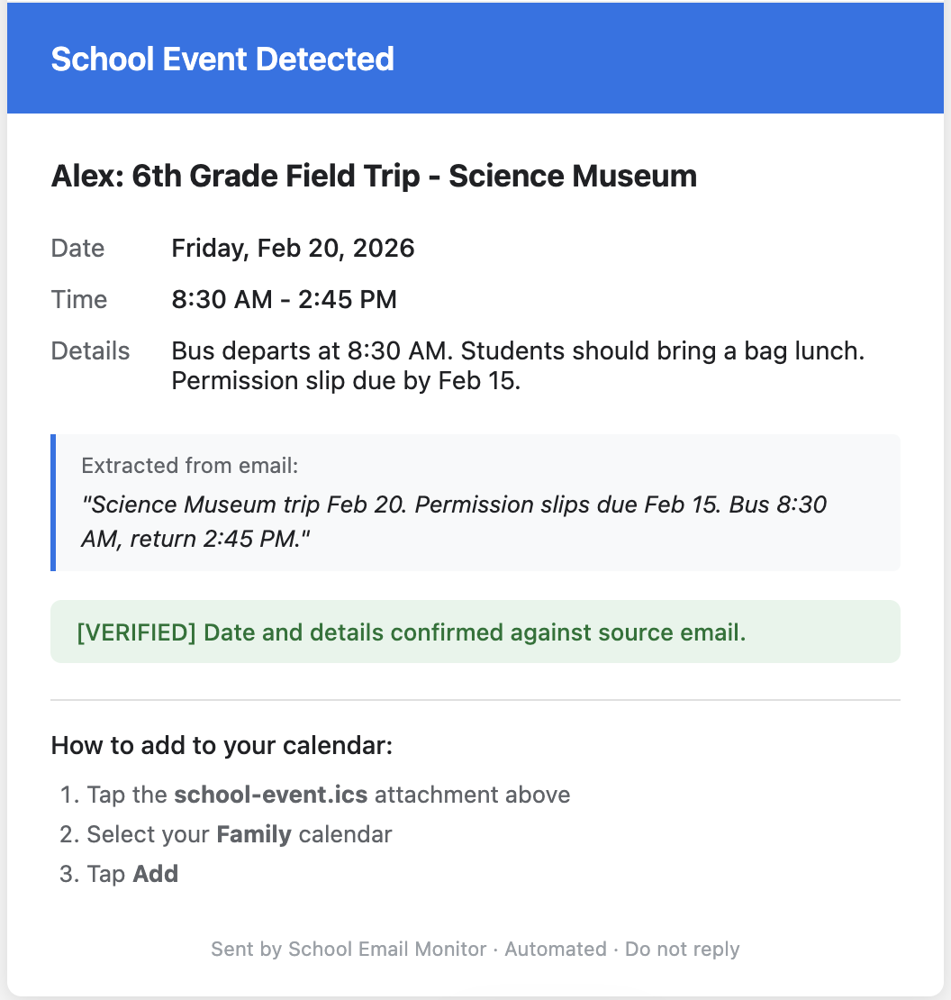

# 🏫 School Email Monitor

**A free, AI-powered system that reads your kids' school emails, summarizes them by grade, sends you Slack notifications, and creates Apple Calendar events — all automatically.**

Built for busy parents who are drowning in school emails and need the signal without the noise.


---

## 📖 The Problem

If you're a parent with kids in school, you know the pain:

- **Dozens of emails per week** from teachers, the office, the district, the PTA
- **Multiple kids = multiple streams** — each with their own grade-specific info buried in school-wide blasts
- **Important dates get lost** — field trips, early dismissals, picture days, permission slip deadlines
- **Both parents need to know** — but only one is usually on the email list
- **You find out about the bake sale at 10 PM the night before**

This project solves all of that.

---

## ✨ What It Does

Every morning at 7 AM (+ every 8 hours), this system automatically:

1. **Reads** all unread school emails from a dedicated Gmail inbox
2. **Filters** by grade — only shows you what's relevant to each kid
3. **Summarizes** using Google Gemini AI (free tier)
4. **Verifies** every date and fact against the original email (anti-hallucination)
5. **Sends a Slack message** with the summary + verified events to both parents
6. **Emails `.ics` calendar invites** that you tap to add to your Apple Family Calendar

---

## 📱 What It Looks Like

### Slack Notification

```
📘 Alex — 6th grade

Math test Thursday Feb 12 on Ch 7. Permission slips
for Science Museum trip due Feb 15. Early dismissal
Wed at 1:30 PM.

📅 Verified Events:
> 1. Alex: Math Test Ch 7
>    📆 2026-02-12
>    📧 "Math test Thursday February 12 on Ch 7"
> 2. Alex: Science Museum Trip
>    📆 2026-02-20 at 08:30
>    📧 "Science Museum trip Feb 20. Bus 8:30 AM"

✉️ 2 .ics invite(s) sent to email.
```

### Calendar Invite Email (Professional HTML)

<p align="center">
  
</p>

The email includes:
- Clean, professional formatting (no broken emoji characters)
- Event details in a readable layout
- Source quote from the original school email
- Green "VERIFIED" badge (or yellow "LOW CONFIDENCE" warning)
- One-tap `.ics` attachment for Apple Calendar

---

## 🏗️ Architecture

```
┌──────────────────────────────────────────────────────────────────────────┐
│                         YOUR PERSONAL EMAIL                             │
│                                                                          │
│  Forwarding rules send school emails to dedicated Gmail:                 │
│    • Kid 1's school  ──→  schoolbot+6th@gmail.com                       │
│    • Kid 2's school  ──→  schoolbot+2nd@gmail.com                       │
│    • District/Town   ──→  schoolbot+town@gmail.com                      │
└────────────────────────────────┬─────────────────────────────────────────┘
                                 │
                                 ▼
┌──────────────────────────────────────────────────────────────────────────┐
│                      COLLECTOR GMAIL ACCOUNT                             │
│                                                                          │
│  Gmail filters auto-label by "To" address:                               │
│    • schoolbot+6th@gmail.com   ──→  label: school-6th                   │
│    • schoolbot+2nd@gmail.com   ──→  label: school-2nd                   │
│    • schoolbot+town@gmail.com  ──→  label: school-town                  │
└────────────────────────────────┬─────────────────────────────────────────┘
                                 │
                                 │  Triggered every 8 hours + 7 AM daily
                                 ▼
┌──────────────────────────────────────────────────────────────────────────┐
│                      GOOGLE APPS SCRIPT                                  │
│                      (runs free on Google's servers)                      │
│                                                                          │
│  For each label (kid / town):                                            │
│    1. Fetch unread emails                                                │
│    2. Send to Gemini AI for analysis                                     │
│    3. Run local verification engine                                      │
│    4. Post to Slack + send .ics invites                                  │
└───────────┬──────────────────────┬───────────────────────────────────────┘
            │                      │
            ▼                      ▼
┌─────────────────────┐  ┌──────────────────────────────────────┐
│   GOOGLE GEMINI AI   │  │   VERIFICATION ENGINE (no AI)        │
│   (free tier)        │  │                                      │
│                      │  │   6 checks per event:                │
│   • Reads emails     │  │   ✓ Date format valid                │
│   • Filters by grade │  │   ✓ Date within reasonable range     │
│   • Extracts events  │  │   ✓ Date found in original email     │
│   • Cites sources    │  │   ✓ Source quote matches email       │
│   • Rates confidence │  │   ✓ Time format valid                │
│                      │  │   ✓ Confidence level check           │
│   Temperature: 0.0   │  │                                      │
│   (zero creativity)  │  │   BLOCKED = not sent to calendar     │
└─────────────────────┘  │   VERIFIED = sent to calendar        │
                          └──────────────────────────────────────┘
            │                      │
            ▼                      ▼
┌─────────────────────┐  ┌─────────────────────────────┐
│   SLACK WEBHOOK      │  │   EMAIL + .ICS ATTACHMENT    │
│                      │  │                              │
│   #school-updates    │  │   Professional HTML email    │
│   Both parents see   │  │   with .ics file attached    │
│   instant alerts     │  │                              │
│                      │  │   Tap → Add to Apple         │
│   ✅ Verified events │  │   Family Calendar            │
│   ⚠️ Flagged items   │  │                              │
│   ❌ Blocked fakes   │  │   1-hour + 1-day reminders   │
└─────────────────────┘  └─────────────────────────────┘
```

---

## 💬 Why Slack? (And Not SMS/iMessage/WhatsApp)

I originally built this with SMS text messages using carrier email-to-SMS gateways (e.g., `number@tmomail.net`). Here's why I switched:

| Option | Problem |
|---|---|
| **SMS (carrier gateway)** | Unreliable delivery. T-Mobile, AT&T, and others increasingly block automated email-to-SMS. Messages arrive late or not at all. No rich formatting. |
| **iMessage** | Apple provides zero API access. Cannot send iMessages programmatically. Period. |
| **WhatsApp** | Requires Meta Business API with paid per-message pricing. Not free. |
| **Telegram** | Free and reliable, but requires both parents to install another app they may not use |
| **Slack ✅** | Free tier is generous. Instant push notifications. Rich formatting (bold, quotes, links). Both parents see the same channel. Works on iOS and Android. No message limits for our volume. |

**Slack is the sweet spot**: free, instant, reliable, rich formatting, and both parents get notifications without any carrier nonsense.

---

## 🛡️ Anti-Hallucination: How Verification Works

AI can hallucinate — it might invent dates, create events that don't exist, or misread information. This system has **3 layers of protection** to ensure nothing fake reaches your calendar:

### Layer 1: Strict Prompt Engineering (AI Side)

- **Temperature set to 0.0** — most deterministic output, zero creativity
- AI must provide a `source_quote` — the exact phrase from the email for every event
- AI must self-rate `confidence` as "high" or "low"
- Vague references like "field trip soon" or "sometime next month" with no specific date → AI is instructed to NOT create an event

### Layer 2: Local Verification Engine (Code Side, No AI)

Every event Gemini returns is checked by pure string-matching against the raw email text:

| Check | What It Catches |
|---|---|
| Date format | Malformed dates like `2026-13-45` |
| Date range | Dates more than 1 year in past or future |
| **Date in email** | Searches for the date in every common format (`Feb 20`, `2/20`, `February 20th`, `02/20/2026`, etc.) in the actual email. **If the date doesn't appear anywhere in any email, the event is blocked.** |
| Source quote | Verifies ≥60% of the quoted words exist in the email text |
| Time format | Strips invalid times rather than sending bad data |
| Confidence | Flags low-confidence events for manual review |

### Layer 3: Parent Notification (Transparency)

- ✅ **Verified events** → `.ics` calendar invite sent + "VERIFIED" badge in email
- ❌ **Unverified events** → **Blocked from calendar**. Parent gets Slack message: "Could not verify: [event]. Reason: Date not found in email. Please check manually."
- ⚠️ **Low confidence events** → Sent but flagged with yellow warning in both Slack and email
- 📧 **Source quotes included** → Every calendar event shows the exact email text it was extracted from, so you can trace it back

---

## 💰 Cost Breakdown

| Service | Cost | Notes |
|---|---|---|
| Gmail (collector) | Free | Google account |
| Google Apps Script | Free | Runs on Google's servers |
| Google Gemini API | Free | Free tier: 1,500 requests/day (bot uses ~3-9/day) |
| Slack | Free | Free plan supports unlimited messages in channels |
| Apple Calendar `.ics` | Free | Standard calendar format |
| **Total** | **$0/month** | |

---

## 🚀 Complete Setup Guide

**Time required: ~20 minutes**

### Prerequisites

- A Google/Gmail account
- A free Slack workspace
- An iPhone with Apple Calendar
- A computer to set up the script (one-time)

---

### Step 1: Create a Dedicated Collector Gmail Account

**Why a separate account?** Your personal inbox stays clean. All school emails funnel into one place where the bot can read them without touching your personal email.

1. Go to [accounts.google.com](https://accounts.google.com) and create a new Gmail account
   - Example: `yourfamily.school@gmail.com`
   - This is the account the bot will read from
2. Remember the credentials — you'll need to log into this account for Steps 4-8

---

### Step 2: Set Up Email Forwarding from Your Personal Email

In your **personal email** (the one that currently receives school emails), you'll create forwarding rules to send school emails to the collector account.

#### The Gmail + Alias Trick (Recommended)

Gmail ignores everything after a `+` in an email address. So if your collector email is `yourfamily.school@gmail.com`:

- `yourfamily.school+6th@gmail.com` → same inbox
- `yourfamily.school+2nd@gmail.com` → same inbox
- `yourfamily.school+town@gmail.com` → same inbox

All three arrive in the same inbox, but the **"To" address is different**, which makes filtering reliable.

#### 2a. Enable Forwarding (One-Time)

In your **personal Gmail**:
1. Settings ⚙️ → **See all settings** → **Forwarding and POP/IMAP**
2. Click **"Add a forwarding address"**
3. Add all three:
   - `yourfamily.school+6th@gmail.com`
   - `yourfamily.school+2nd@gmail.com`
   - `yourfamily.school+town@gmail.com`
4. Google sends a confirmation to the collector account — log in there and confirm each

#### 2b. Create Forwarding Filters in Personal Gmail

Go to Settings ⚙️ → **Filters and Blocked Addresses** → **Create a new filter**

**Filter 1 — Kid 1 (e.g., 6th grade):**
| Field | Value |
|---|---|
| From | `teacher1@school.org OR office@school.org` |

*(Use the actual "From" addresses you see on school emails for this kid)*

→ Create filter → ☑ **Forward it to** `yourfamily.school+6th@gmail.com`
→ ☑ Also apply to matching conversations

**Filter 2 — Kid 2 (e.g., 2nd grade):**
| Field | Value |
|---|---|
| From | `teacher2@school.org OR 2ndgrade@school.org` |

→ Forward to `yourfamily.school+2nd@gmail.com`

**Filter 3 — Town/District:**
| Field | Value |
|---|---|
| From | `superintendent@district.org OR noreply@district.org` |

→ Forward to `yourfamily.school+town@gmail.com`

> **Tip:** If both kids are at the same school and emails come from the same address (e.g., `office@school.org`), you can forward everything to one alias and let the AI sort by grade. Or use subject-line keywords in your filters.

---

### Step 3: Create Gmail Labels in the Collector Account

Log into your **collector Gmail account** (`yourfamily.school@gmail.com`).

Create 3 filters based on the "To" address:

**Filter 1:**
1. Settings ⚙️ → Filters → Create new filter
2. **To:** `yourfamily.school+6th@gmail.com`
3. Create filter → ☑ Apply label: **Create new → `school-6th`**
4. ☑ Also apply to matching conversations

**Filter 2:**
- **To:** `yourfamily.school+2nd@gmail.com` → Label: `school-2nd`

**Filter 3:**
- **To:** `yourfamily.school+town@gmail.com` → Label: `school-town`

Now every school email auto-labels itself based on which kid/source it's for.

---

### Step 4: Set Up Google Gemini API (Free Tier)

This bot uses **Gemini 2.5 Flash Lite** — Google's lightweight AI model. The free tier is more than enough for this project.

#### 4a. Create a Google Cloud Project (If You Don't Have One)

1. Go to [console.cloud.google.com](https://console.cloud.google.com)
2. If prompted, agree to the Terms of Service
3. Click the project dropdown at the top → **"New Project"**
4. Name it: `School Email Monitor` → Click **Create**
5. Make sure it's selected as the active project

#### 4b. Enable the Gemini API

1. Go to [aistudio.google.com](https://aistudio.google.com)
2. Sign in with your Google account
3. If prompted to enable the API, click **Enable**
4. Alternatively, go directly to [console.cloud.google.com/apis/library](https://console.cloud.google.com/apis/library) → search for **"Generative Language API"** → click **Enable**

#### 4c. Create an API Key

1. Go to [aistudio.google.com/apikey](https://aistudio.google.com/apikey)
2. Click **"Create API Key"**
3. Select **"Create API key in new project"** (recommended) or select your existing project
4. Copy the key — save it somewhere secure for Step 7

#### 4d. Verify Your Key Works

You can test the key immediately by running this in your browser's address bar (replace `YOUR_KEY`):

```
https://generativelanguage.googleapis.com/v1beta/models/gemini-2.5-flash-lite:generateContent?key=YOUR_KEY
```

- If you get a response (even an error about missing body), the key works
- If you get `API_KEY_INVALID`, double-check the key
- If you get `NOT_FOUND`, the model name may have changed (see Troubleshooting)

#### Free Tier vs. Paid — Do I Need to Pay?

**No billing account is required to run this project.** The free tier quota is more than enough.

| | Free Tier (No Billing) | Paid Tier (Billing Enabled) |
|---|---|---|
| **Requests/minute** | 15 | 2,000 |
| **Requests/day** | 1,500 | Unlimited |
| **This bot uses** | **~9-12 requests/day** | — |
| **Cost** | $0 | Pay per token (but free credits cover it) |
| **Credit card required** | No | Yes (but $300 free credit) |

The bot makes 1 API call per label per run. With 3 labels (2 kids + town) running 3-4 times/day = ~9-12 requests/day. The free tier allows 1,500/day — you'll use less than 1% of your quota.

#### ⚠️ Important: Free Tier vs. Paid Tier Data Privacy

This is the most important nuance most guides don't mention. **The biggest difference between free and paid isn't speed — it's how Google handles your data.**

| | Free Tier (No Billing) | Paid Tier (Billing Enabled) |
|---|---|---|
| **Data used to train Google's models?** | **Yes** — Google may use your inputs and outputs to improve their models, including potential review by human workers | **No** — your data is not used for training |
| **When does paid tier apply?** | — | As soon as you link a billing account, even if you stay within free volume limits |
| **Best for** | Testing, non-sensitive content | Any data containing personal information |

**What this means for school emails:** Your school emails likely contain your children's names, teacher names, school names, event details, and possibly other personal family information. On the free tier, this data *may* be reviewed by Google to improve their AI models.

**Recommendation:**

- **For testing and getting started:** Free tier is fine. Run the test functions, verify everything works.
- **For daily production use with real school emails:** Enable billing. You likely won't be charged anything (Google gives $300 free credit for new accounts, and this bot's usage costs fractions of a penny), but your family's data will be protected from model training.

**How to enable billing (takes 2 minutes):**

1. Go to [console.cloud.google.com/billing](https://console.cloud.google.com/billing)
2. Click **"Create Account"** or **"Link a billing account"**
3. Add a credit card — Google gives **$300 free credit** for new accounts
4. Link the billing account to the project your API key belongs to
5. That's it — you're now on paid tier terms even if your actual usage stays within free limits

> **Will I be charged?** Almost certainly not. Gemini 2.5 Flash Lite costs fractions of a cent per request. Even running 365 days/year at 12 requests/day, your annual cost would be well under $1 — covered entirely by the $300 free credit. But you now have the data privacy protection of the paid tier.

#### Gemini Model Selection

This project uses `gemini-2.5-flash-lite` — the fastest and most cost-effective model. If it's unavailable, try these alternatives in order:

| Model | Speed | Quality | Free Tier |
|---|---|---|---|
| `gemini-2.5-flash-lite` ✅ | Fastest | Great for extraction | Yes |
| `gemini-2.0-flash-lite` | Fast | Good | Yes |
| `gemini-2.0-flash` | Medium | Better | Yes |
| `gemini-1.5-flash-latest` | Medium | Good | Yes |

Change the model in `CONFIG.GEMINI_MODEL` if needed. No other code changes required.

---

### Step 5: Set Up Slack

#### 5a. Create a Free Workspace

1. Go to [slack.com](https://slack.com) → **Create a new workspace**
2. Name it something like "Family School Updates"
3. Create a channel: `#school-updates`
4. Invite your partner/co-parent

#### 5b. Create a Slack Webhook

1. Go to [api.slack.com/apps](https://api.slack.com/apps)
2. Click **"Create New App"** → **"From Scratch"**
3. **App Name:** `School Bot` | **Workspace:** select yours
4. In the left sidebar → **Incoming Webhooks** → Toggle **ON**
5. Scroll down → **"Add New Webhook to Workspace"**
6. Select the `#school-updates` channel → **Allow**
7. Copy the **Webhook URL** (looks like `https://hooks.slack.com/services/T.../B.../xxx`)

#### 5c. Enable Notifications on Both Phones

Both parents should:
1. Install the Slack app on their phone
2. Open the `#school-updates` channel
3. Tap the channel name at top → **Notifications** → **Every new message**

---

### Step 6: Create the Google Apps Script Project

1. **Log into your collector Gmail account** in the browser
2. Go to [script.google.com](https://script.google.com)
3. Click **"New Project"**
4. Click "Untitled project" at the top → rename to `School Email Monitor`
5. **Delete** all default code in the editor
6. Copy the entire contents of [`school-email-monitor.js`](school-email-monitor.js) from this repo
7. **Paste** into the editor
8. Press **Ctrl+S** (Cmd+S on Mac) to save

> **Important:** You must be logged into the collector Gmail account. The script reads emails from whichever Google account owns the Apps Script project.

---

### Step 7: Configure Your Settings

At the top of the script, update the `CONFIG` object:

```javascript
const CONFIG = {
  GEMINI_API_KEY: 'paste-your-gemini-key-here',
  GEMINI_MODEL: 'gemini-2.5-flash-lite',
  SLACK_WEBHOOK_URL: 'https://hooks.slack.com/services/YOUR/WEBHOOK/URL',
  PERSONAL_EMAIL: 'you@icloud.com',  // Where .ics invites go
  TIMEZONE: 'America/New_York',

  KIDS: [
    {
      name: 'Child1',        // Your kid's name
      grade: '6th grade',    // Grade to filter for
      gmail_label: 'school-6th',
      emoji: '📘',
    },
    {
      name: 'Child2',
      grade: '2nd grade',
      gmail_label: 'school-2nd',
      emoji: '📗',
    },
  ],

  TOWN_LABEL: 'school-town',
  TOWN_NAME: 'Town/District',   // Or your actual town name
  TOWN_EMOJI: '🏛️',
};
```

| Setting | What to enter |
|---|---|
| `GEMINI_API_KEY` | Your key from Step 4 |
| `SLACK_WEBHOOK_URL` | Your webhook from Step 5b |
| `PERSONAL_EMAIL` | Email on your iPhone where you want `.ics` invites (iCloud works best) |
| `TIMEZONE` | Your timezone ([list](https://en.wikipedia.org/wiki/List_of_tz_database_time_zones)) |
| `KIDS` | One entry per child: name, grade, and matching Gmail label from Step 3 |
| `TOWN_LABEL` | Gmail label for district-wide emails |

---

### Step 8: Authorize & Run Tests

#### 8a. First-Time Authorization

1. In the script editor, select **`test1_Slack`** from the function dropdown (top bar)
2. Click **▶ Run**
3. A popup says "Authorization required" → Click **"Review permissions"**
4. Select your collector Gmail account
5. Warning: "Google hasn't verified this app" → Click **"Advanced"** → **"Go to School Email Monitor (unsafe)"**
6. Click **"Allow"**

> **This is safe** — you wrote the script. It only accesses your own Gmail account.

#### 8b. Run All Tests in Order

| Order | Function | What It Tests | Expected Result |
|---|---|---|---|
| 1 | `test1_Slack` | Slack connection | Message appears in `#school-updates` |
| 2 | `test2_Gemini` | AI analysis + grade filtering | Check Execution Log for summary + events |
| 3 | `test3_CalendarInvite` | `.ics` email delivery | HTML email with attachment arrives |
| 4 | `test4_TownEmails` | Town/district processing | Check Execution Log for verified events |
| 5 | `test5_HallucinationCheck` | Verification catches fake data | Log shows "PASS: All hallucinated events blocked" |
| 6 | `test6_FullPipeline` | Full end-to-end for all kids | Slack messages + calendar emails arrive |

**To check logs:** View → Execution log (or click 📋 Executions in the left sidebar)

---

### Step 9: Go Live

Run **`setupTriggers()`** once. This creates:

| Trigger | Schedule | Purpose |
|---|---|---|
| Every 8 hours | ~3x/day rolling | Catches afternoon and evening emails |
| Daily 7 AM | Every morning | Priority morning check for daily school updates |

**That's it. You're live.**

To verify triggers are active: Click the **⏰ clock icon** in the left sidebar. You should see 2 triggers listed.

> **No deployment needed.** Google Apps Script runs server-side. Once saved + triggers set = it's running.

---

## 📁 Repository Structure

```
school-email-monitor/
├── README.md                       # This file
├── LICENSE                         # MIT License
├── school-email-monitor.js         # Main script — paste into Apps Script
└── docs/
    ├── TROUBLESHOOTING.md          # Common issues and fixes
    ├── CUSTOMIZATION.md            # Modify for your needs
    └── images/
        └── email-screenshot.png    # Sample email screenshot
```

---

## 🔧 Customization

### Add or Remove Kids

Edit the `KIDS` array in `CONFIG`. Works with any number of children.

### One Kid Only

```javascript
KIDS: [
  { name: 'Child1', grade: '6th grade', gmail_label: 'school-6th', emoji: '📘' },
],
```

### Three+ Kids

Just add more entries to the array. Each needs its own Gmail label.

### Change the Schedule

Modify `setupTriggers()` or delete and recreate triggers:

```javascript
// Every 4 hours instead of 8
ScriptApp.newTrigger('checkSchoolEmails')
  .timeBased().everyHours(4).create();

// Fixed times: 7 AM, 2 PM, 9 PM
ScriptApp.newTrigger('checkSchoolEmails')
  .timeBased().atHour(7).everyDays(1).create();
ScriptApp.newTrigger('checkSchoolEmails')
  .timeBased().atHour(14).everyDays(1).create();
ScriptApp.newTrigger('checkSchoolEmails')
  .timeBased().atHour(21).everyDays(1).create();
```

### Switch to Separate Slack Channels per Kid

1. Create channels: `#child1-6th`, `#child2-2nd`, `#town-updates`
2. Create a webhook for each channel
3. Add `slack_webhook` to each kid in CONFIG
4. Modify `processKidEmails()` to use the kid-specific webhook

### Use Google Calendar Instead of Apple Calendar

Replace `sendCalendarInvite()` with Google Calendar API:
```javascript
CalendarApp.getCalendarById('your-calendar-id@group.calendar.google.com')
  .createEvent(event.title, startDate, endDate, { description: event.description });
```

---

## ❗ Troubleshooting

| Problem | Solution |
|---|---|
| **Gemini 404 error** | Model name changed. Try alternatives in order: `gemini-2.5-flash-lite` → `gemini-2.0-flash-lite` → `gemini-2.0-flash`. See [TROUBLESHOOTING.md](docs/TROUBLESHOOTING.md). |
| **Gemini 429 / quota** | Create API key in a new project. If `limit: 0`, link a billing account (free $300 credit). See Step 4 for full walkthrough. |
| **Gemini 403 / not enabled** | Enable the "Generative Language API" in your Google Cloud project. See [TROUBLESHOOTING.md](docs/TROUBLESHOOTING.md). |
| **No Slack messages** | Run `test1_Slack`. Verify webhook URL. Check Slack channel permissions. |
| **Emails not found** | Confirm label names match exactly (case-sensitive). Ensure emails are unread. |
| **`.ics` won't open** | Open from **Apple Mail** app, not Gmail app. Gmail doesn't handle `.ics` well on iOS. |
| **Broken emoji (??????)** | Already fixed in this version. The `name` field and email body use plain text only. |
| **Script timeout** | Google Apps Script has a 6-minute limit. Very rare unless 100+ emails accumulate. |
| **Wrong grade filtering** | Check Gmail labels. Send a test email to each alias and verify the label is applied. |
| **Triggers not firing** | Re-run `setupTriggers()`. Check Executions tab for errors. Re-authorize if prompted. |
| **Want to stop the bot** | Run `removeTriggers()` |

---

## 🧪 Testing Tips

- **Send yourself test emails:** Forward a real school email to your collector Gmail. Apply the label manually. Mark it unread. Run `manualRun()`.
- **Check logs obsessively at first:** The Execution Log shows exactly what happened — which emails were read, what Gemini returned, which events passed/failed verification.
- **Test the hallucination checker:** Run `test5_HallucinationCheck()` to see the verification engine catch fake events from a vague email.

---

## 🤝 Contributing

Contributions welcome! Ideas for improvement:

- [ ] Google Calendar direct integration (skip `.ics` emails)
- [ ] Telegram bot as alternative notification channel
- [ ] Weekly digest summary on Sunday evenings
- [ ] Multi-language support for non-English school emails
- [ ] Web dashboard for viewing past summaries

---

## 📄 License

MIT License — see [LICENSE](LICENSE) for details.

---

## 🙏 Acknowledgments

- **Google Gemini** for free AI summarization
- **Google Apps Script** for free serverless execution
- **Slack** for reliable, free notifications
- Built by a parent, for parents. Because nobody should miss picture day again.
